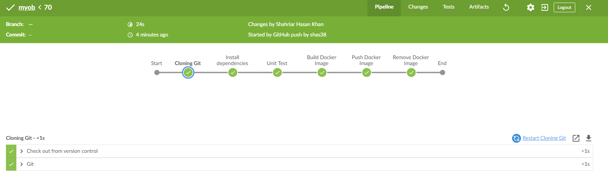

# myob
This project contains a simple web server with three endpoints. The purpose of this project is to demonstrate how a CI/CD pipeline can be implemented. 

1. The pipeline starts once the user commits changes to the codebase to this repository.
2. A Jenkins server uses SCM pooling to track changes on the git repository.
3. Once a new change is committed the Jenkins servers pulls the new code and install all the dependencies.
4. It then runs all the unit tests to make sure that the new changes are not breaking any functionality.
5. If the unit tests are successful, then the Jenkins server builds a docker image using the Dockerfile.
6. The server then pushes the new image to the docker hub for public use.
7. Finally, the server removes the image from local storage.

The pipeline can be seen in the image below.

